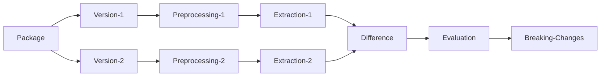

# 

[](https://github.com/StardustDL/aexpy/actions) [](https://github.com/StardustDL/coxbuild/blob/master/LICENSE) [](https://pypi.org/project/aexpy/) [](https://pepy.tech/project/aexpy) [](https://hub.docker.com/r/stardustdl/aexpy)

[AexPy](https://github.com/StardustDL/aexpy) */eɪkspaɪ/* is **A**pi **EX**plorer in **PY**thon for detecting API breaking changes in Python packages.

> AexPy is the prototype implementation of the conference paper "**AexPy: Detecting API Breaking Changes in Python Packages**" in Proceedings of the 33rd IEEE International Symposium on Software Reliability Engineering ([ISSRE 2022](https://issre2022.github.io/)), Charlotte, North Carolina, USA, October 31 - November 3, 2022.
> 
> If you use our approach or results in your work, please cite it according to [the citation file](https://github.com/StardustDL/aexpy/blob/main/CITATIONS.bib).
> 
> X. Du and J. Ma, "AexPy: Detecting API Breaking Changes in Python Packages," 2022 IEEE 33rd International Symposium on Software Reliability Engineering (ISSRE), 2022, pp. 470-481, doi: 10.1109/ISSRE55969.2022.00052.

https://user-images.githubusercontent.com/34736356/182772349-af0a5f20-d009-4daa-b4a9-593922ed66fe.mov

- **How AexPy works?** Approach Design & Evaluation are in [AexPy's conference paper](https://ieeexplore.ieee.org/abstract/document/9978982), see also [talk](https://www.bilibili.com/video/BV1tv4y1D75F/) & [slides](https://stardustdl.github.io/assets/pdfs/aexpy/aexpy-slides.pdf).
- **How we implement AexPy?** Source Code & Implemetation are in [AexPy's repository](https://github.com/StardustDL/aexpy), see also [system design (zh-cn)](https://stardustdl.github.io/assets/pdfs/aexpy/aexpy-chinasoft.pdf).
- **How to use AexPy?** Detailed Document & Data are in [AexPy's documents](https://aexpy-docs.netlify.app/), see also [demo video](https://www.bilibili.com/video/BV1PG411F77m/) and [online AexPy (viewer only)](https://aexpy.netlify.app/).

> **Attention**: For AexPy v0.1.x users, we have removed web front-end support in AexPy's Python package, and are focusing on command-line interface for now. The web interfaces are provided as [online AexPy (viewer only)](https://aexpy.netlify.app/) now.
> For the old available version, see [v0.1.2](https://github.com/StardustDL/aexpy/releases/tag/v0.1.2).



AexPy also provides a framework to process Python packages, extract APIs, and detect changes, which is designed for easily reusing and customizing. See the following "Advanced Tools" section and the source code for details.

## Quick Start

Diff generator-oj-problem v0.0.1 and v0.0.2.

- Save API descriptions to `cache/api1.json` and `cache/api2.json`
- Output report to `report.txt`

```sh
pip install aexpy
mkdir -p cache

aexpy preprocess -r -p generator-oj-problem@0.0.1 ./cache - | aexpy extract - ./cache/api1.json
aexpy preprocess -r -p generator-oj-problem@0.0.2 ./cache - | aexpy extract - ./cache/api2.json
aexpy diff ./cache/api1.json ./cache/api2.json - | aexpy report - - | aexpy view - > report.txt
```

View results on [online AexPy](https://aexpy.netlify.app/).

- generator-oj-problem@0.0.1 [Distribution](https://aexpy.netlify.app/distributions/generator-oj-problem@0.0.1/) and [API](https://aexpy.netlify.app/apis/generator-oj-problem@0.0.1/)
- generator-oj-problem@0.0.2 [Distribution](https://aexpy.netlify.app/distributions/generator-oj-problem@0.0.2/) and [API](https://aexpy.netlify.app/apis/generator-oj-problem@0.0.2/)
- [Changes](https://aexpy.netlify.app/changes/generator-oj-problem@0.0.1:0.0.2/) and [Report](https://aexpy.netlify.app/changes/generator-oj-problem@0.0.1:0.0.2/)

## Features

- Preprocessing
  - Download packages and get source code, or use existing code base.
  - Count package file sizes and lines of code.
  - Read package metadata and detect top modules.
- Extracting
  - Extract APIs from Python packages, including modules, classes, functions, attributes.
  - Collect detailed APIs, including parameters, instance attributes.
  - Detect API aliases and build call graphs.
  - Enrich type information for APIs by static type analyzers.
- Diffing
  - Detect API changes after pairing APIs between two versions.
  - Grade changes by their severities.
- Reporting
  - Generate a human-readable report for API change detection results.
- Framework
  - Customize processors and implementation details.
  - Process Python packages in AexPy's general pipeline with logging and caching.
  - Generate portable data in JSON for API descriptions, changes, and so on.
  - Execute processing and view data by AexPy's command-line, with stdin/stdout supported.

## Install

We provide the Python package on PyPI. Use pip to install the package.

```sh
python -m pip install --upgrade aexpy
aexpy --help
```

> Please ensure your Python interpreter works in [UTF-8 mode](https://peps.python.org/pep-0540/).

We also provide the Docker image to avoid environment errors.

```sh
docker pull stardustdl/aexpy:latest
docker run --rm stardustdl/aexpy:latest --help

# or the image from the main branch
docker pull stardustdl/aexpy:main
```

## Usage

> All results produced by AexPy are in JSON format, so you could modify it in any text editor.

### Preprocess

Preprocess a distribution for a package release.

AexPy provide four preprocessing mode:

- `-r`, `--release`: download and unpack the package wheel and automatically load from dist-info
- `-w`, `--wheel`: Unpack existing package wheel file and automatically load from dist-info
- `-d`, `--dist`: Automatically load from unpacked wheel, and its dist-info
- `-s`, `--src`: (default) Use given distribution information (path to code, package name, modules)

AexPy will automatically load package name, version, top-level modules, and dependencies from dist-info.

There are also options to specify fields in the distribution:

- `-p`, `--project`: Package name and its version, e.g. `project@version`.
- `-m`, `--module`: (multiple) Top-level module names.
- `-D`, `--depends`: (multiple) Package dependencies.
- `-R`, `--requirements`: Package `requirements.txt` file path, to load dependencies.
- `-P`, `--pyversion`: Specify Python version for this distribution, supported Python 3.8+.

> You could also modify the generated distribution file in a text editor to change field values.

```sh
# download the package wheel and unpack into ./cache
# output the distribution file to ./cache/distribution.json
aexpy preprocess -r -p generator-oj-problem@0.0.1 ./cache ./cache/distribution.json
# or output the distribution file to stdout
aexpy preprocess -r -p generator-oj-problem@0.0.1 ./cache -

# use existing wheel file
aexpy preprocess -w ./cache/generator_oj_problem-0.0.1-py3-none-any.whl ./cache/distribution.json

# use existing unpacked wheel directory, auto load metadata from .dist-info directory
aexpy preprocess -d ./cache/generator_oj_problem-0.0.1-py3-none-any ./cache/distribution.json

# use existing source code directory, given the package's name, version, and top-level modules
aexpy preprocess ./cache/generator_oj_problem-0.0.1-py3-none-any ./cache/distribution.json -p generator-oj-problem@0.0.1 -m generator_oj_problem
```

> View results at [AexPy Online](https://aexpy.netlify.app/distributions/generator-oj-problem@0.0.1/).

### Extract

Extract the API description from a distribution.

AexPy would dynamically import the target module to detect all available APIs. So please ensure all dependencies have been installed in the extraction environment, or specify the `dependencies` field in the distribution, and AexPy will install them into the extraction environment.

> If the `wheelFile` field is valid (i.e. the target file exists), AexPy will firstly try to install the wheel and ignore the `dependencies` field (used when the wheel installation fails).

- Use flag `--no-temp` to let AexPy use the current Python environment (as same as AexPy) as the extraction environment (the default behavior of the installed AexPy package).
- Use flag `--temp` to let AexPy create a temporary conda environment that matches the distribution's pyverion field (the default behavior of our docker image).
- Use option `-e`, `--env` to specify an existing conda env name as the extraction environment (will ignore the temp flag).

```sh
aexpy extract ./cache/distribution.json ./cache/api.json
# or input the distribution file from stdin 
# (this feature is also supported in other commands)
aexpy extract - ./cache/api.json
# or output the api description file to stdout
aexpy extract ./cache/distribution.json -

# Use a conda env named demo-env
aexpy extract ./cache/distribution.json - -e demo-env
# Create a temporary conda env
aexpy extract ./cache/distribution.json - --temp
```

> View results at [AexPy Online](https://aexpy.netlify.app/apis/generator-oj-problem@0.0.1/).

### Diff

Diff two API descriptions and detect changes.

```sh
aexpy diff ./cache/api1.json ./cache/api2.json ./cache/diff.json
```

> View results at [AexPy Online](https://aexpy.netlify.app/changes/generator-oj-problem@0.0.1:0.0.2/).

### Report

Generate report from detect changes.

```sh
aexpy report ./cache/diff.json ./cache/report.json
```

> View results at [AexPy Online](https://aexpy.netlify.app/reports/generator-oj-problem@0.0.1:0.0.2/).

### View

View produced data.

```sh
aexpy view ./cache/distribution1.json
aexpy view ./cache/distribution2.json
aexpy view ./cache/api1.json
aexpy view ./cache/api2.json
aexpy view ./cache/diff.json
aexpy view ./cache/report.json
```

### Docker Image

The docker image keeps the same command-line interface, only need a volume mapping to `/data` for file access.

```sh
docker run -v $pwd/cache:/data aexpy/aexpy extract /data/distribution.json /data/api.json
```

## Advanced Tools

### Logging

The processing may cost time, you can use multiple `-v` for verbose logs (which are outputed to stderr).

```sh
aexpy -vvv view ./cache/report.json
```

### Interactive

Add `-i` or `--interact` to enable interactive mode, every command will create an interactive Python shell after finishing processing. Here are some useful variable you could use in the interactive Python shell.

- `result`: The produced data object
- `context`: The producing context, use `exception` to access the exception if failing to process

```sh
aexpy -i view ./cache/report.json
```

> Feel free to use `locals()` and `dir()` to explore the interactive environment.

### Pipeline

AexPy has four loosely-coupled stages in its pipeline. The adjacent stages transfer data by JSON, defined in [models](https://github.com/StardustDL/aexpy/blob/main/src/aexpy/models/) directory. You can easily write your own implementation for every stage, and combine your implementation into the pipeline. See [third](https://github.com/StardustDL/aexpy/blob/main/src/aexpy/third/) directory for an example on how to implement stages and integrate other tools.