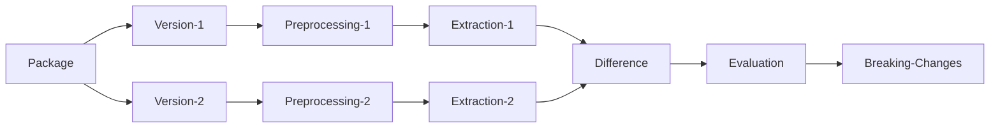

# 

[](https://github.com/StardustDL/aexpy/actions) [](https://github.com/StardustDL/coxbuild/blob/master/LICENSE) [](https://pypi.org/project/aexpy/) [](https://pepy.tech/project/aexpy) [](https://hub.docker.com/r/stardustdl/aexpy)

> **Attention**: v0.1.2 is the **FINAL** version of the original AexPy with web interfaces. The current implementation introduces a few unnecessary complexity, and limits the usability. We plan to rewrite a more flexible implementation, focusing on the core features of AexPy to provide a more useful tool for developers. See the [main](https://github.com/StardustDL/aexpy) branch for details.

[AexPy](https://github.com/StardustDL/aexpy) */eɪkspaɪ/* is **A**pi **EX**plorer in **PY**thon for detecting API breaking changes in Python packages.

> AexPy is the prototype implementation of the conference paper "**AexPy: Detecting API Breaking Changes in Python Packages**" in Proceedings of the 33rd IEEE International Symposium on Software Reliability Engineering ([ISSRE 2022](https://issre2022.github.io/)), Charlotte, North Carolina, USA, October 31 - November 3, 2022.
> 
> If you use our approach or results in your work, please cite it according to [the citation file](https://github.com/StardustDL/aexpy/blob/main/CITATIONS.bib).
>
> X. Du and J. Ma, "AexPy: Detecting API Breaking Changes in Python Packages," 2022 IEEE 33rd International Symposium on Software Reliability Engineering (ISSRE), 2022, pp. 470-481, doi: 10.1109/ISSRE55969.2022.00052.

https://user-images.githubusercontent.com/34736356/182772349-af0a5f20-d009-4daa-b4a9-593922ed66fe.mov

- **How AexPy works?** Approach Design & Evaluation are in [AexPy's conference paper](https://ieeexplore.ieee.org/abstract/document/9978982), see also [talk](https://www.bilibili.com/video/BV1tv4y1D75F/) & [slides](https://stardustdl.github.io/assets/pdfs/aexpy/aexpy-slides.pdf).
- **How we implement AexPy?** Source Code & Implemetation are in [AexPy's repository](https://github.com/StardustDL/aexpy), see also [system design (zh-cn)](https://stardustdl.github.io/assets/pdfs/aexpy/aexpy-chinasoft.pdf).
- **How to use AexPy?** Detailed Document & Data are in [AexPy's website](https://aexpy.netlify.app/), see also [demo video](https://www.bilibili.com/video/BV1PG411F77m/).



AexPy also provides a framework to process Python packages, extract APIs, and detect changes, which is designed for easily reusing and customizing. See the following "Advanced Tools" section and the source code for details.

## Features

- Preprocessing
  - Build packages and get source code.
  - Count package file sizes and lines of code.
  - Read package metadata and detect top modules.
- Extracting
  - Extract APIs from Python packages, including modules, classes, functions, attributes.
  - Collect detailed APIs, including parameters, instance attributes.
  - Detect API aliases and build call graphs.
  - Enrich type information for APIs by static type analyzers.
- Diffing
  - Detect API changes after pairing APIs between two versions.
  - Grade changes by their severities.
- Reporting
  - Generate a human-readable report for API change detection results.
- Batching
  - Process packages and releases in batch.
- Framework
  - Customize processors and implementation details.
  - Process Python packages in AexPy's general pipeline with logging and caching.
  - Generate portable data in JSON for API descriptions, changes, and so on.
  - Execute processing and view data by AexPy's command-line / RESTful APIs / front-end.

## Install

We recommend using our Docker image for running AexPy. Other distributions may suffer from environment errors.

```sh
docker pull stardustdl/aexpy:latest

# or the image from the main branch

docker pull stardustdl/aexpy:main
```

> To run the original package instead of the image, please ensure your Python interpreter works in [UTF-8 mode](https://peps.python.org/pep-0540/).

## Usage

### Front-end

AexPy provides a convenient frontend for exploring APIs and changes. Use the following command to start the server, and then access the front-end at `http://localhost:8008` in browser.

```sh
docker run -p 8008:8008 stardustdl/aexpy:latest serve
```

The front-end depends on the AexPy's RESTful APIs at the endpoint `/api`.

### Command-line

Use the following command to detect changes between v1.0 and v2.0 of a package named demo:

```sh
docker run stardustdl/aexpy:latest report demo@1.0:2.0

# e.g. detect API changes between jinja2 v3.1.1 and v3.1.2
docker run stardustdl/aexpy:latest report jinja2@3.1.1:3.1.2
```

Use the following command to extract API information of v1.0 of a package named demo:

```sh
docker run stardustdl/aexpy:latest extract demo@1.0

# e.g. extract APIs from click v8.1.3
docker run stardustdl/aexpy:latest extract click@8.1.3
```

For all available commands, use the following command:

```sh
docker run stardustdl/aexpy:latest --help
```

## Advanced Tools

### Batching

AexPy supports processing all available versions of a package in batch.

```sh
aexpy batch coxbuild
```

### Logging

The processing may cost time, you can use multiple `-v` for verbose logs.

```sh
docker run aexpy:latest -vvv extract click@8.1.3
```

### Data

You can mount cache directory to `/data` to save the processed data. AexPy will use the cache data if it exists, and produce results in JSON format under the cache directory.

```sh
docker run -v /path/to/cache:/data aexpy:latest extract click@8.1.3

cat /path/to/cache/extracting/types/click/8.1.3.json
```

### Pipeline

AexPy has four stages in its pipeline, use the following commands to run the corresponding stage.

```sh
aexpy preprocess coxbuild@0.0.1
aexpy extract coxbuild@0.0.1
aexpy diff coxbuild@0.0.1:0.0.2
aexpy report coxbuild@0.0.1:0.0.2
```

The four stages are loosely coupled. The adjacent stages transfer data by JSON, defined in [models](https://github.com/StardustDL/aexpy/blob/main/src/aexpy/models/) directory. You can easily write your own implementation for every stage, and combine your implementation into the pipeline. See [third](https://github.com/StardustDL/aexpy/blob/main/src/aexpy/third/) directory for an example on how to implement stages and integrate other tools.